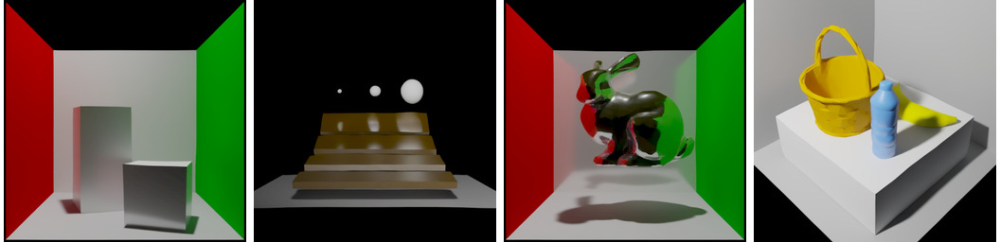
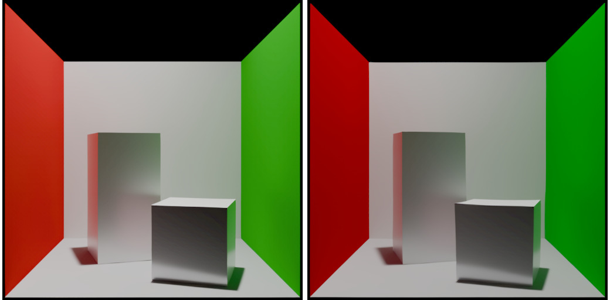

<p align="center">
  <h1 align="center">RenderFormer CUDA Engine</h1>
  <p align="center">
    Standalone CUDA/C++20 inference engine for
    <a href="https://github.com/microsoft/renderformer"><strong>RenderFormer</strong></a>
    (SIGGRAPH 2025)
  </p>

  <div align="center">
    
    <br>
    Scenes rendered by the CUDA engine at 512×512 — Cornell box, Veach MIS, Stanford bunny, room interior.
  </div>

  <p align="center">
  <br>
    <a href="https://microsoft.github.io/renderformer/"><strong>Project Page</strong></a>
    |
    <a href="https://arxiv.org/abs/2505.21925"><strong>Paper</strong></a>
    |
    <a href="https://huggingface.co/microsoft/renderformer-v1.1-swin-large"><strong>Model</strong></a>
    |
    <a href="https://github.com/microsoft/renderformer"><strong>Official Python Code</strong></a>
  </p>
</p>

Loads model weights directly from safetensors, renders scenes from HDF5 — no Python or PyTorch runtime required. Includes an interactive real-time viewer with trackball camera.

## Features

- **Standalone C++20/CUDA** — zero Python dependencies at runtime, loads safetensors + HDF5 directly
- **8.3× faster** than PyTorch reference (78ms vs 1.5s per view at 512×512)
- **Near real-time** at 320×320 (~34ms/view, 30 FPS)
- **Interactive viewer** — GLFW/OpenGL with trackball camera, double-buffered async rendering
- **cuDNN fused SDPA** — tensor-core flash attention for cross-attention layers
- **cuDNN implicit GEMM** — all DPT conv2d/conv_transpose2d via cuDNN backend
- **CUDA Graph capture** — 732-node graph replay with zero CPU launch overhead
- **Full fp16 inference** — mixed-precision encoder + full fp16 decoder with 2-pass online softmax
- **KV cache** — cross-attention K,V computed once after encoder, reused across all views
- **Zero-alloc hot path** — all GPU buffers preallocated at session creation

## Performance

Benchmarked on RTX 3080 Ti (12GB), model `renderformer-v1.1-swin-large` (483M params):

| | Python (PyTorch fp16) | CUDA Engine (512×512) | CUDA Engine (320×320) |
|---|---|---|---|
| Encoder (one-time) | ~4.5s | 112ms | 112ms |
| **Per-view render** | ~1.5s | **78ms** | **34ms** |
| Total pipeline | PyTorch + FlashAttn + CUDA | cuBLAS + cuDNN + CUDA | same |

**8.3× faster** than PyTorch at 512×512. Near real-time (30 FPS) at 320×320.

<details>
<summary>Multi-scene benchmark (512×512)</summary>

| Scene | Triangles | Per-View | PSNR vs Python (EXR) |
|---|---|---|---|
| veach-mis | 4,575 | 80ms | 27.4 dB |
| cbox | 5,633 | 78ms | 26.8 dB |
| cbox-bunny | 6,209 | 79ms | 45.8 dB |
| room | 7,141 | 84ms | 33.5 dB |

</details>

<details>
<summary>Resolution scaling (cbox, 5633 triangles)</summary>

| Resolution | Per-View | Pixel Tokens |
|---|---|---|
| 256×256 | 21.5ms | 1,024 |
| 320×320 | 33.6ms | 1,600 |
| 384×384 | 44ms | 2,304 |
| 512×512 | 78ms | 4,096 |

Per-view time scales linearly with pixel token count (~20μs/token).

</details>

<div align="center">
  
  <br>
  <em>Left: Python (PyTorch fp32) &nbsp;|&nbsp; Right: CUDA Engine (fp16) — PSNR 26.8 dB</em>
</div>

## Quick Start

```bash
git clone --recursive https://github.com/BANANASJIM/renderformer-cuda.git
cd renderformer-cuda
./scripts/setup.sh
```

The setup script will check dependencies, download model weights (~1.9 GB), detect your GPU architecture, and build.

### Manual Build

```bash
cmake -B build -DCMAKE_CUDA_ARCHITECTURES=86  # 86=Ampere, 89=Ada, 90=Hopper
cmake --build build -j$(nproc)
```

### Requirements

- CUDA Toolkit 12+ (cuBLAS, cuDNN)
- HDF5 C library
- C++20 compiler (GCC 11+ or Clang 14+)
- CMake 3.24+
- GLFW3 + OpenGL *(optional, for interactive viewer)*

<details>
<summary>Install on Ubuntu/Debian</summary>

```bash
sudo apt install cmake libhdf5-dev zlib1g-dev libglfw3-dev
# CUDA Toolkit: https://developer.nvidia.com/cuda-downloads
# cuDNN: https://developer.nvidia.com/cudnn
```

</details>

<details>
<summary>Install on Arch Linux</summary>

```bash
sudo pacman -S cmake hdf5 zlib glfw
# CUDA + cuDNN from official NVIDIA repos or AUR
```

</details>

## Usage

### Render a Scene

```bash
# Convert scene JSON → HDF5 (requires Python + renderformer repo)
python3 scene_processor/convert_scene.py examples/cbox.json --output_h5_path cbox.h5

# Render with CUDA engine
./build/renderformer \
  --model models/model.safetensors \
  --scene cbox.h5 \
  --output output/ \
  --res 512
```

Outputs per view: `view_N.exr` (HDR linear) and `view_N.png` (LDR, AgX tonemapped).

### Interactive Viewer

```bash
./build/renderformer_app \
  --model models/model.safetensors \
  --scene cbox.h5
```

Controls: mouse drag to orbit, scroll to zoom, WASD to pan, R to reset camera.

<!--
TODO: Add viewer demo video/GIF here
<div align="center">
  
</div>
-->

## Architecture

```
src/
  core/        cuda_utils.h, tensor.h         — GPU memory, stream, cuBLAS handles
  io/          safetensors, hdf5, image_writer — model/scene loading, EXR/PNG output
  kernels/     rmsnorm, rope, nerf_pe,         — fused CUDA kernels
               softmax, activations,
               ray_gen, coord_transform
  layers/      linear, attention, transformer,  — neural network layers
               dpt
  model/       config.h, renderformer          — model config, weight mapping
  pipeline/    render_session, renderer        — session-based rendering API
  app/         viewer, camera                  — interactive GLFW/OpenGL viewer
test/          test_compare, test_encoder       — numerical validation tests
scripts/       setup.sh, validate.sh           — build and validation scripts
```

### Key Design Choices

- **Mixed-precision encoder** — fp32 hidden state, fp16 GEMMs via tensor cores, fp32 RMSNorm + residual
- **Full fp16 decoder** — all GEMMs + softmax in fp32 with fused fp16 cast
- **cuDNN fused SDPA** for cross-attention — single tensor-core kernel for Q×K^T→softmax→×V
- **cuBLAS batched GEMM** for swin self-attention — cuDNN SDPA too slow for small 64×64 windows
- **cuDNN implicit GEMM** for all DPT convolutions — replaces im2col + cuBLAS GEMM
- **CUDA Graph capture** (732 nodes) — zero CPU-side launch overhead per frame
- **Cross-attention KV cache** — K,V computed once after encoder, pre-padded for aligned GEMM
- **Session-based API** — all GPU buffers preallocated at session creation, zero mallocs in hot path

### Numerical Accuracy

PSNR 27–46 dB (HDR EXR) vs PyTorch fp32 reference across test scenes. The fp16 precision loss is imperceptible in rendered images.

## License

MIT License. See [LICENSE](LICENSE) for details.

Model weights are from [microsoft/renderformer-v1.1-swin-large](https://huggingface.co/microsoft/renderformer-v1.1-swin-large) (MIT License).

## Citation

```bibtex
@inproceedings{zeng2025renderformer,
    title     = {RenderFormer: Transformer-based Neural Rendering of Triangle Meshes with Global Illumination},
    author    = {Chong Zeng and Yue Dong and Pieter Peers and Hongzhi Wu and Xin Tong},
    booktitle = {ACM SIGGRAPH 2025 Conference Papers},
    year      = {2025}
}
```

## Acknowledgements

- [RenderFormer](https://github.com/microsoft/renderformer) — original PyTorch implementation by Microsoft Research
- [NVIDIA cuDNN Frontend](https://github.com/NVIDIA/cudnn-frontend) — header-only C++ library for cuDNN graph API
- [stb_image_write](https://github.com/nothings/stb) — PNG output
- [tinyexr](https://github.com/syoyo/tinyexr) — EXR HDR output
